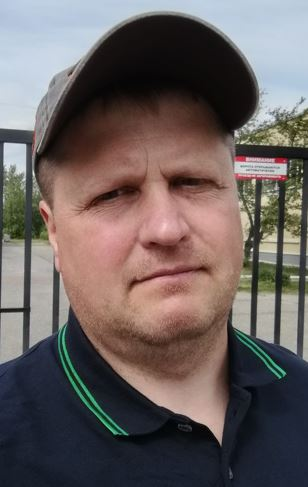

# Stepan Neduzhiy
===============================

A long-long time ago, _in the last century_, I discovered the world of computer technology: from films ("Hackers", "The Lawnmower Man", etc.), book fiction, scientific articles. The first computers _(such as the ZX-Spectrum, Pravetz 8M)_ appeared, then game consoles, well, you know the rest of the story. At the moment, the priority for me is to learn the basics of programming for further advancement.

I am mainly a consumer of the **content of YouTube** and various courses of programming.

I want to travel, play sports and earn money by programming.

_I'm open to collaborating on any kind of movement, except hunger strike._

==============================
